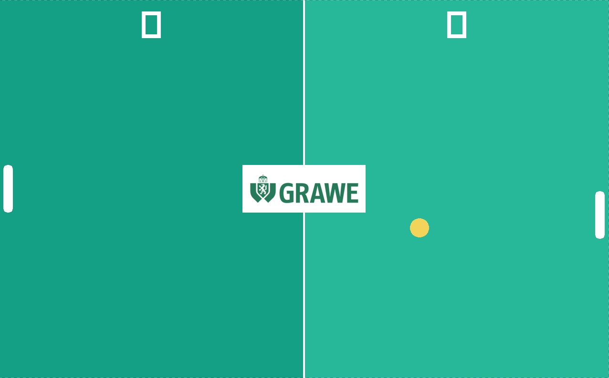

# GRAWE Minigame Collection

This repository contains small games developed during my IT internship at **GRAWE** in August 2026. 

The development took place in consultation with my supervisor and after all assigned tasks in my core area (IT project management) were successfully completed.

---

## 🎮 How to Play (No Programming Required!)

If you just want to play the games, you do not need to install any programming tools or compile the code yourself. Simply download the pre-packaged files:

1. Navigate to the **Releases** section on the right side of this GitHub page.
2. Download the latest `.zip` file under the "Assets" dropdown (e.g., `GRAWE-Pong-Windows-v1.0.0.zip`).
3. **Important:** Right-click the downloaded `.zip` file and select **"Extract All..."**. Do not run the game directly from inside the `.zip` preview window.
4. Open the newly extracted folder and double-click the `.exe` file (e.g., `grawe_pong.exe`) to start the game.

*Note: Ensure the `assets` folder remains in the exact same directory as the executable, otherwise the graphics will not load.*

---

## 🕹️ Included Games

### 1. Pong (GRAWE Edition)
A classic Pong clone featuring a GRAWE-inspired design, programmed in C++ using the Raylib library.



<!-- ### 2. Snake (GRAWE Edition) -->

---

## 👨‍💻 For Developers (Compilation from Source)

If you want to review the source code, modify the game, or compile it yourself, this project utilizes a cross-platform `Makefile` that automatically detects the operating system (Windows, macOS, Linux) and applies the appropriate build parameters.

### Prerequisites
The following components are required for successful compilation:
* A C++ compiler (`g++` for Windows/Linux, `clang++` for macOS)
* A Make tool (`mingw32-make` on Windows, `make` on Linux/macOS)
* The **[Raylib library](https://www.raylib.com/)** (On Windows, the default path `C:/raylib/raylib/src` is expected; on macOS, an installation via Homebrew is required).

### Compilation Instructions
To compile and run the games, open a terminal in the root folder of this repository. The following commands will build the source code and automatically start the respective game:

**On Windows:**
```powershell
mingw32-make run-pong
mingw32-make run-snake
```

**On macOS/Linux:**

```bash
make run-pong
make run-snake
```
